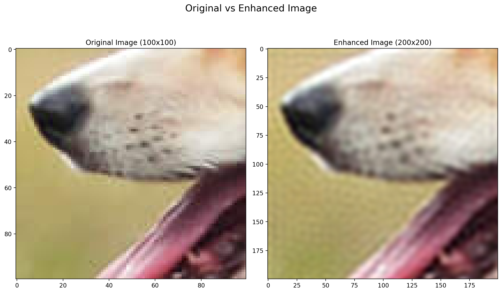

# Image Super Resolution and Reconstruction
Important Links to codes used to create this file:

A) [Qualitative Analysis](https://github.com/Kishan-Ved/Image-SuperResolution-Reconstruction/blob/main/Image_SuperResolution_Qualitative.ipynb)

B) [Quantitative Analysis](https://github.com/Kishan-Ved/Image-SuperResolution-Reconstruction/blob/main/Image_SuperResolution._Quantitative.ipynb)

C) [Image Reconstruction](https://github.com/Kishan-Ved/Image-SuperResolution-Reconstruction/blob/main/Image_Reconstruction.ipynb)

 
## Super-Resolution Using Random Fourier Features and Linear Regression

### $A.$ Qualitative Analysis

The provided code performs Qualitative Analysis of Super-Resolution on a given Image using a Linear Model trained on Random Fourier Features. Here is the breakdown of the code:

1. **Imports:**
    The necessary libraries such as PyTorch, torchvision, matplotlib, urllib, numpy, sklearn, einops, and warnings are imported. All of these libraries are necessary for the code to run.

2. **Loading the Image:**
    The image of a dog as mentioned in the question is taken form the instructer's code and read using `torchvision.io.read_image` function. The image is then displayed using matplotlib.

    

        
    

+
3. **Scaling the RGB Values:**
    The RGB values of the image are scaled from 0 to 1 using Min-Max scaler from the sklearn.preprocessing module.
    The formula for scaling the RGB values is given by:

    **\[ X_{scaled} = \frac{X_{max}-X}{X_{max}-X_{min}} \]**  
    where \( X_{max} \) and \( X_{min} \) are the maximum and minimum values of the RGB channels, respectively.
    
4. **Cropping the Image:**
    Due to the memory constraints, the size of the target image we took is 100 x 100. The image is cropped to this size using the   `torchvision.transforms.functional.crop` function.

    

        
        
    

    
Cropped Image (100 x 100)

5. **Creating Coordinate Map:**
    A function is defined to create a coordinate map for the original image. The coordinate map consists of coordinates and corresponding to the pixel values of all the three channels (R G B).

6. **Training the Linear Model:**
    Another function is defined to train a linear model on the random Fourier features extracted from the coordinate map after scaling it. The model is trained using mean squared error loss and Adam optimizer.

7. **Plotting Original vs. Enhanced Image:**
    A function is defined to plot the original image and the enhanced image side by side.

8. **Enhancing the Image:**
    An overall function that takes the original image, number of random Fourier features, sigma (kernel width for RBF sampler), learning rate, and number of epochs as input. It then creates random Fourier features, trains the linear model, and plots the original and enhanced images.
    * The general equation for the Fourier basis functions can be expressed as follows:

        **For sine basis functions:
        \[ \psi_k(x) = \sin(k \omega x + b_k) \]**

        **For cosine basis functions:
        \[ \phi_k(x) = \cos(k \omega x + b_k) \]**

        Where:
        - \( k \) is the frequency index,
        - \( \omega \) is the angular frequency,
        - \( x \) is the input variable,
        - \( b_k \) is a randomly generated phase offset.
        \(\newline\)

    * The bandwidth parameter **\( \sigma \)** influences the spread or width of the basis functions indirectly through the angular frequency **\( \omega \)**. Typically, **\( \omega = \frac{1}{\sigma} \)**. However, the direct inclusion of **\( \sigma \)** in the equation for Fourier basis functions is less common, as **\( \sigma \)** primarily affects the kernel function used in kernel methods rather than the basis functions themselves.

9. **Enhancing the Image for Different Sigmas:**
    The image is enhanced for different values of sigma for finding the better sigma (kernel width for RBF Sampler, it represents the bandwidth parameter of the fourier basis used for feature mapping), and the enhanced images are stored in a list.
    * For **\( \sigma \)** = 0.1
  
    

        
    

    
    * For **\( \sigma \)** = 0.04
  
    

        
    

    * For **\( \sigma \)** = 0.001
    

        
    

    
    As you can see for higher **\( \sigma \)** values, the model is creating less complex decision boundaries and is not able to capture the fine details of the image. On the other hand, for lower **\( \sigma \)** values, the model is creating more complex decision boundaries and is able to capture the fine details of the image but further decreasing the **\( \sigma \)** value will lead to overfitting and the model will not be able to generalize well on the test data. This we can see in the image with **\( \sigma \)** = 0.001, the model has high variance.

10. **Output:**
     The comparison between the low-resolution image and the enhanced image is displayed for each sigma value. On comparison it is found that the image with the sigma value of around 0.04 gives the best results.

    * For **\( \sigma \)** = 0.04
  
    

        
    

The code effectively demonstrates Super-Resolution using a linear model trained on Random Fourier Features. It provides a qualitative comparison between the original and enhanced images, showing how the resolution is improved. Additionally, it allows experimenting with different values of sigma to observe their effects on the enhanced image over different bandwidths of the fourier basis used for feature mapping. We will also see the quantitative analysis in the next part of the question which will allow us to evaluate the performance of the super-resolution technique using RMSE and PSNR.

**NOTE:** *The quality of the output image depends on the choice of sigma (kernel width for RBF sampler) and the number of random Fourier features used, which can be further optimized using Hyperparameter Tuning.*

### $B.$ Quantitative Analysis

The study can be further improved by adding quantitative analysis to evaluate the performance of the super-resolution technique. This can be done by calculating and comparing metrics such as Root Mean Square Error (RMSE) and Peak Signal-to-Noise Ratio (PSNR) between the Original $N$ x $N$ Image and Enhance $N$ x $N$ Image from $N/2$ x $N/2$ Image. Here is the breakdown of the code:

1. **Original Image (400 x 400):**  
   The original image is the cropped image of size 400 x 400 pixels. This serves as the ground truth for comparison.
  
    

        
    

    
Ground Truth Image (400 x 400)

2. **Low-Resolution Image (200 x 200):**  
   The original image is downsampled using 2D convolution to create a low-resolution image with dimensions of 200 x 200 pixels.

    

        
    

    
Low-Resolution Image (200 x 200)

3. **Generating Random Fourier Features:**  
   Random Fourier features are generated for the scaled coordinates of the low-resolution image using the RBF Sampler. training a linear model on these features to learn the mapping from low to high resolution.

4. **Training the Linear Model on RFF:**
   The Linear Model has input features equal to the Random Fourier Features and the output features equal to the RGB values of the original image i.e, 3. The model is trained using mean squared error loss and Adam optimizer.
   
5. **Enhanced Image (400 x 400):**  
   The learned model is then applied to the coordinate map of the low-resolution image to generate an enhanced version with dimensions of 400 x 400 pixels.
    

        
    

    [The image here formed is made with the sigma value of 0.03 and number of random Fourier features as 10000. As the 10000 features are not able to represent the data properly, the image is not enhanced properly and is not very comparable to the original image. This can be improved by increasing the number of random Fourier features which requires more computation and memory.]
  
6. **Quantitative Metrics:** 
   The mean squared error (RMSE) and peak signal-to-noise ratio (PSNR) are calculated to quantitatively assess the similarity between the original and enhanced images. These metrics provide objective measures of the quality of the enhancement.
   The formulas for RMSE and PSNR are as follows:

    - Root Mean Square Error (RMSE):
      \[ RMSE = \sqrt{\frac{1}{N} \sum_{i=1}^{N} (x_i - y_i)^2} \]
      where \( N \) is the total number of pixels in the image, \( x_i \) is the pixel value of the original image, and \( y_i \) is the pixel value of the enhanced image. We will calculate RMSE for each channel (R, G, B) and then take the sum of the three values.

    - Peak Signal-to-Noise Ratio (PSNR):
      \[ PSNR = 20 \log_{10}\left(\frac{MAX_I}{\sqrt{MSE}}\right) \]
      where \( MAX_I \) is the maximum possible pixel value (1.0 for scaled pixels values) and \( MSE \) is the mean squared error between the original and enhanced images.
    
7. **Output:**
    The RMSE and PSNR values that we got from the above calculations are as follows:
    - RMSE:  0.05166782811284065 
    - PSNR:  25.73858642578125
  
    The high PSNR value indicates that the enhanced image is very similar to the original image, and the low RMSE value further confirms this. The quantitative analysis provides a more objective evaluation of the super-resolution technique, allowing us to assess the effectiveness of the method in improving image resolution while preserving important features.

Overall, this approach allows for both qualitative and quantitative evaluation of the super-resolution technique. By comparing the original and enhanced images and calculating RMSE and PSNR, it provides insights into the effectiveness of the method in improving image resolution while preserving important features. 

### $C.$ Reconstruction of the Image

In this part, we randomly remove data from an image and then reconstruct it using random fourier features and linear regression. 

The following is the actual image:

    

Now, we will randomly remove data from this image and reconstruct it. This image has a size of 400 x 400 pixels. For all the cases below, we use sigma 0.025 (for the RBF sampler) and 10000 random Fourier features.

1. **Remove 90% Data:**

    The image with 90% of the data removed is as follows:
   
   

    
    

    The predicted image is:

    

    
    

    Root Mean Sqaured Error:  0.0786
    PSNR: 22.08719840300042

2. **Remove 80% Data:**

    The image with 80% of the data removed is as follows:
   
   

    
    

    The predicted image is:

    

    
    

    Root Mean Sqaured Error:  0.0387
    PSNR: 28.25418146450278
3. **Remove 70% Data:**

    The image with 70% of the data removed is as follows:
   
   

    
    

    The predicted image is:

    

    
    

    Root Mean Sqaured Error:  0.0330
    PSNR: 29.63423604352773

4. **Remove 60% Data:**
    
    The image with 60% of the data removed is as follows:
    
    

    
    

    
    The predicted image is:
    
    

    
    

    Root Mean Sqaured Error:  0.0309
    PSNR: 30.210612612395682

5. **Remove 50% Data:**
        
    The image with 50% of the data removed is as follows:
    
    

    
    

    
    The predicted image is:
    
    

    
    

    Root Mean Sqaured Error:  0.0301
    PSNR: 30.43539642977963

6. **Remove 40% Data:**
                
    The image with 40% of the data removed is as follows:
    
    

    
    

    
    The predicted image is:
    
    

    
    

    Root Mean Sqaured Error:  0.0295
    PSNR: 30.596299417410222

7. **Remove 30% Data:**
                    
    The image with 30% of the data removed is as follows:
    
    

    
    

    
    The predicted image is:
    
    

    
    

    Root Mean Sqaured Error:  0.0292
    PSNR: 30.686033211585062
    
8. **Remove 20% Data:**
                            
    The image with 20% of the data removed is as follows:
    
    

    
    

    
    The predicted image is:
    
    

    
    

    Root Mean Sqaured Error:  0.0289
    PSNR: 30.78619621879038
9. **Remove 10% Data:**
                                    
    The image with 10% of the data removed is as follows:
    
    

    
    

    
    The predicted image is:
    
    

    
    

    Root Mean Sqaured Error:  0.0286
    PSNR: 30.86548449905607

#### Plots

##### RMSE vs Percentage of Data Removed

The following plot shows the RMSE for different percentages of data removed from the image (denoted by x-axis):

##### PSNR vs Percentage of Data Removed

The following plot shows the Peak Signal to Noise Ratio for different percentages of data removed from the image (denoted by x-axis):

#### Observations:

1.   As we remove data, the rmse value increases as expected. This is because the error (with respect to the original image's pixel values) increases, as we have less data to train the model.
2.   As we remove data, the peak SNR (signal to noise ratio) decreases. This is because now we have more data to train the model on, so the error (which is the noise) decreases.

As we have lesser data to train on, our model cannot capture all the details of the image. We fit features based on data available and extrapolate these over unknown points, thus, we can't capture all the details, rather, it's an extrapolated approximation.

10000 features have been used because of computational limitations. If the number of features are increased, then the model will be able to capture more details and the reconstructed image will be better.

On increasing the value of sigma, the image becomes smoother and the details are not captured properly. On decreasing the value of sigma, the model overfits and the reconstructed image is not good. Thus, the value of sigma should be chosen carefully.

**Changing sigma:**

The image with 90% of the data removed is as follows:

The predicted image for sigma = 0.025 is:

The predicted image for sigma = 0.03 is:

